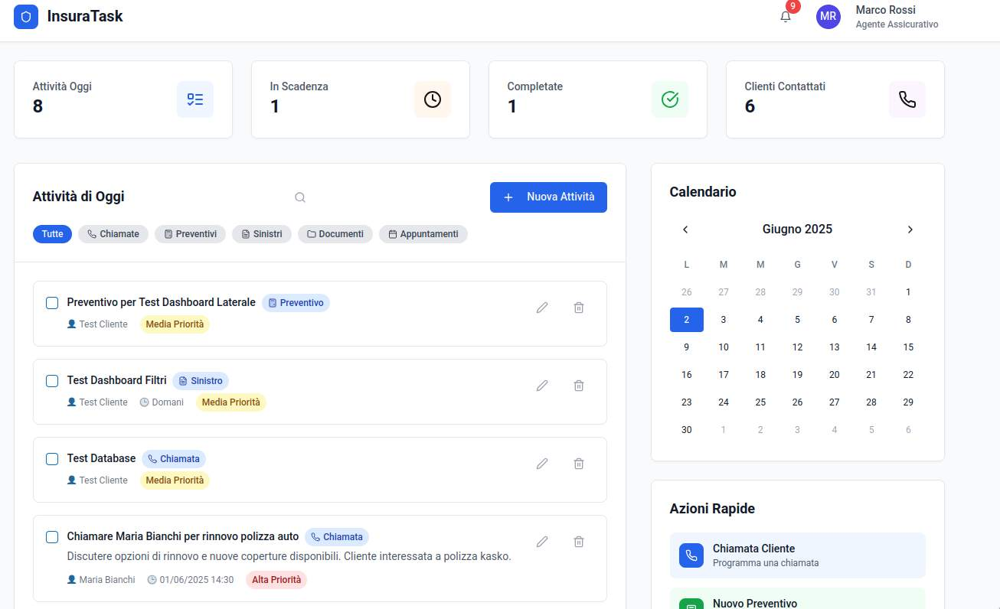
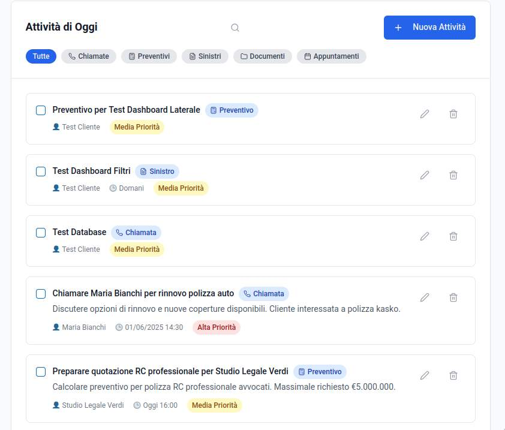

# 🛡️ InsuraTask

**Una moderna applicazione web per la gestione delle attività di agenti assicurativi**

[](https://www.typescriptlang.org/)
[](https://reactjs.org/)
[](https://nodejs.org/)
[](https://expressjs.com/)
[](https://www.sqlite.org/)

---

## 📋 Panoramica

InsuraTask è una soluzione completa per agenti assicurativi che vogliono ottimizzare la gestione delle loro attività quotidiane. L'applicazione offre un'interfaccia intuitiva per organizzare chiamate, preventivi, sinistri, documentazione e appuntamenti con i clienti.

### 🎯 Obiettivi
- **Centralizzare** la gestione delle attività assicurative
- **Migliorare** l'organizzazione temporale degli agenti
- **Ridurre** le attività perse o dimenticate
- **Fornire** una panoramica chiara delle priorità quotidiane

## 📸 Screenshots

### 🏠 Dashboard Principale

*Vista principale con statistiche, lista attività e calendario integrato*

### 📋 Gestione Attività

*Lista attività con filtri, ricerca e azioni rapide*

---

## ✨ Funzionalità Principali

### 📊 Dashboard Intelligente
- **Statistiche real-time**: Panoramica delle attività totali, in scadenza, completate
- **Notifiche smart**: Alert per attività in ritardo e scadenze del giorno
- **Metriche visuali**: Card colorate con icone specifiche per ogni categoria

### 📅 Gestione Attività Avanzata
- **CRUD completo**: Crea, modifica, elimina e visualizza attività
- **Categorie specializzate**: Chiamate, Preventivi, Sinistri, Documenti, Appuntamenti
- **Priorità e stati**: Sistema di priorità (bassa/media/alta) e stati (pending/completed/overdue)
- **Ricerca potente**: Filtro per categoria, ricerca testuale su titolo/descrizione/cliente

### 🗓️ Calendario Integrato
- **Vista mensile**: Navigazione fluida tra i mesi
- **Indicatori eventi**: Punti colorati per categoria di attività
- **Selezione date**: Filtro attività per data specifica
- **Dettaglio giornaliero**: Popover con riepilogo attività del giorno

### ⚡ Azioni Rapide
- **Quick actions**: Bottoni per creazione veloce per categoria
- **Form pre-compilati**: Categoria e data già selezionate
- **Workflow ottimizzato**: Riduzione dei click per attività comuni

### 👤 Gestione Profilo
- **Profilo personalizzabile**: Nome, email, ruolo, azienda
- **Preferenze utente**: Tema chiaro/scuro, lingua, notifiche
- **Persistenza locale**: Salvataggio automatico delle preferenze

## 🛠️ Stack Tecnologico

### Frontend
- **React 18** - Framework UI moderno con hooks
- **TypeScript** - Type safety e developer experience
- **Vite** - Build tool veloce e moderno
- **Tailwind CSS** - Utility-first CSS framework
- **shadcn/ui + Radix UI** - Componenti accessibili e customizzabili
- **TanStack Query** - Data fetching e caching intelligente
- **React Hook Form + Zod** - Form management e validazione

### Backend
- **Node.js + TypeScript** - Runtime JavaScript server-side
- **Express.js** - Web framework minimalista
- **SQLite + better-sqlite3** - Database embedded performante
- **Zod** - Schema validation condivisa
- **Drizzle ORM** - Type-safe database queries

### DevOps & Tools
- **ESLint + TypeScript** - Code quality e type checking
- **PostCSS + Autoprefixer** - CSS processing
- **Wouter** - Routing leggero
- **tsx** - TypeScript execution per development

## 🚀 Quick Start

### Prerequisiti
- **Node.js** >= 18.0.0
- **npm** >= 8.0.0

### Installazione

```bash
# 1. Clona il repository
git clone https://github.com/FDRFSR/insuratask.git
cd insuratask

# 2. Installa le dipendenze
npm install

# 3. Avvia l'applicazione in modalità sviluppo
npm run dev

# 4. Apri il browser su http://localhost:5000
```

### Build per Produzione

```bash
# Build completa (frontend + backend)
npm run build

# Avvia in modalità produzione
npm start
```

## 📁 Struttura del Progetto

```
insuratask/
├── 📂 client/                 # Frontend React
│   ├── 📂 src/
│   │   ├── 📂 components/     # Componenti riutilizabili
│   │   │   ├── 📂 ui/        # UI components (shadcn/ui)
│   │   │   ├── 📄 header.tsx
│   │   │   ├── 📄 sidebar.tsx
│   │   │   ├── 📄 task-list.tsx
│   │   │   ├── 📄 task-modal.tsx
│   │   │   └── 📄 enhanced-calendar.tsx
│   │   ├── 📂 contexts/       # React Context providers
│   │   ├── 📂 hooks/          # Custom hooks
│   │   ├── 📂 lib/            # Utility functions
│   │   ├── 📂 pages/          # Page components
│   │   └── 📄 main.tsx        # Entry point
│   └── 📄 index.html
├── 📂 server/                 # Backend Express
│   ├── 📄 index.ts           # Server entry point
│   ├── 📄 routes.ts          # API routes definition
│   ├── 📄 storage.ts         # Data layer interface
│   ├── 📄 sqlite-storage.ts  # SQLite implementation
│   └── 📄 vite.ts            # Vite integration
├── 📂 shared/                # Codice condiviso
│   └── 📄 schema.ts          # Zod schemas e types
├── 📄 package.json
├── 📄 tsconfig.json
├── 📄 tailwind.config.ts
└── 📄 vite.config.ts
```

## 🔌 API Reference

### Endpoints Principali

| Metodo | Endpoint | Descrizione |
|--------|----------|-------------|
| `GET` | `/api/tasks` | Lista attività con filtri |
| `GET` | `/api/tasks/:id` | Dettaglio attività specifica |
| `POST` | `/api/tasks` | Crea nuova attività |
| `PATCH` | `/api/tasks/:id` | Aggiorna attività esistente |
| `DELETE` | `/api/tasks/:id` | Elimina attività |
| `GET` | `/api/tasks/stats` | Statistiche dashboard |

### Query Parameters

```bash
# Filtra per categoria
GET /api/tasks?category=calls

# Filtra per stato  
GET /api/tasks?status=pending

# Ricerca testuale
GET /api/tasks?search=mario+rossi

# Combinazione filtri
GET /api/tasks?category=quotes&status=pending&search=preventivo
```

### Esempio Request/Response

**POST /api/tasks**
```json
{
  "title": "Chiamare Mario Rossi per rinnovo polizza auto",
  "description": "Discutere nuove coperture e sconti famiglia",
  "category": "calls",
  "client": "Mario Rossi",
  "priority": "high",
  "dueDate": "2025-06-03",
  "dueTime": "14:30"
}
```

**Response:**
```json
{
  "id": 1,
  "title": "Chiamare Mario Rossi per rinnovo polizza auto",
  "description": "Discutere nuove coperture e sconti famiglia",
  "category": "calls",
  "client": "Mario Rossi",
  "priority": "high",
  "status": "pending",
  "dueDate": "2025-06-03",
  "dueTime": "14:30",
  "completed": false,
  "completedAt": null,
  "createdAt": "2025-06-02T10:30:00Z",
  "updatedAt": "2025-06-02T10:30:00Z"
}
```

## 🎨 Design System

### Palette Colori

```css
/* Colori Primari */
--primary: #1565C0;           /* Blue - Azioni principali */
--secondary: #B45309;         /* Orange - Azioni secondarie */
--success: #2E7D32;          /* Green - Successo/Completato */
--warning: #F57C00;          /* Orange - Attenzione/Media priorità */
--error: #EF4444;            /* Red - Errore/Alta priorità */

/* Colori Neutri */
--background: #FAFAF9;       /* Sfondo principale */
--foreground: #080808;       /* Testo principale */
--muted: #F5F5F4;           /* Elementi secondari */
--border: #E7E5E4;          /* Bordi */
```

### Categorie Attività

| Categoria | Icona | Colore | Descrizione |
|-----------|-------|---------|-------------|
| `calls` | 📞 | Blue | Chiamate clienti |
| `quotes` | 🧮 | Green | Preventivi e quotazioni |
| `claims` | 📋 | Red | Gestione sinistri |
| `documents` | 📁 | Yellow | Documentazione |
| `appointments` | 📅 | Purple | Appuntamenti |

## 🧪 Testing

```bash
# Type checking
npm run check

# Build test
npm run build

# Linting
npx eslint client/src server/
```

## 🚀 Deployment

### Ambiente di Produzione

1. **Build dell'applicazione**:
   ```bash
   npm run build
   ```

2. **Configurazione variabili d'ambiente**:
   ```bash
   NODE_ENV=production
   PORT=5000
   DATABASE_URL=./production.db
   ```

3. **Avvio del server**:
   ```bash
   npm start
   ```

### Docker (Opzionale)

```dockerfile
FROM node:18-alpine
WORKDIR /app
COPY package*.json ./
RUN npm ci --only=production
COPY dist/ ./dist/
EXPOSE 5000
CMD ["npm", "start"]
```

## 🤝 Contributing

Le contribuzioni sono benvenute! Per contribuire al progetto:

1. **Fork** il repository
2. **Crea** un branch per la tua feature (`git checkout -b feature/amazing-feature`)
3. **Commit** le tue modifiche (`git commit -m 'Add amazing feature'`)
4. **Push** al branch (`git push origin feature/amazing-feature`)
5. **Apri** una Pull Request

### Development Guidelines

- Utilizza **TypeScript** per tutti i nuovi file
- Segui le convenzioni di **ESLint** configurate
- Scrivi **test** per le nuove funzionalità
- Mantieni la **documentazione** aggiornata
- Usa **commit convenzionali** (feat:, fix:, docs:, etc.)

## 🔮 Roadmap

### v1.1 - Enhanced Features
- [ ] Integrazione Google Calendar
- [ ] Export dati in PDF/Excel  
- [ ] Templates attività ricorrenti
- [ ] Attachment files alle attività
- [ ] Reporting avanzato con grafici

### v1.2 - Collaboration
- [ ] Multi-utente con permessi
- [ ] Condivisione attività tra colleghi
- [ ] Comments e note collaborativi
- [ ] Audit log delle modifiche

### v2.0 - Advanced Features
- [ ] Mobile app nativa
- [ ] Modalità offline
- [ ] Integrazione CRM esterni
- [ ] API pubblica per integrazioni
- [ ] Dashboard analytics avanzate

## 📄 License

Questo progetto è rilasciato sotto licenza **MIT**. Vedi il file [LICENSE](LICENSE) per maggiori dettagli.

## 📧 Contatti

**Federico Fusarri**
- 🌐 **LinkedIn**: [federico-fusarri](https://linkedin.com/in/federico-fusarri)
- 🐙 **GitHub**: [FDRFSR](https://github.com/FDRFSR)
- 📧 **Email**: [iscrizioni.fusarri at gmail.com](mailto:iscrizioni.fusarri at gmail.com)

---

## 📸 Come Aggiornare gli Screenshots

Per mantenere gli screenshot aggiornati, segui questi passaggi:

### Setup per Screenshots
```bash
# 1. Avvia l'applicazione in modalità development
npm run dev

# 2. Apri http://localhost:5000 nel browser
# 3. Assicurati che ci siano dati di test nel database
```

### Screenshots da Catturare

1. **dashboard-overview.png** (1920x1080)
   - Vista completa della dashboard
   - Statistiche visibili in alto
   - Task list a sinistra, sidebar a destra
   - Alcune attività di esempio presenti

2. **task-management.png** (1200x800)
   - Focus sulla sezione task list
   - Filtri categoria visibili
   - Alcune attività con stati diversi (pending, completed, overdue)
   - Barra di ricerca con testo di esempio

### Tools Consigliati
- **macOS**: Cmd+Shift+4 per screenshot area
- **Windows**: Windows+Shift+S per Snipping Tool
- **Browser DevTools**: F12 > Device Toolbar per mobile simulation
- **Lightshot** o **CleanShot X** per editing avanzato

### Naming Convention
```
screenshots/
├── dashboard-overview.png
└── task-management.png
```

---

## 🙏 Ringraziamenti

- **shadcn/ui** per i componenti UI di alta qualità
- **Radix UI** per i componenti accessibili
- **Lucide React** per le icone moderne
- **TanStack Query** per il data fetching intelligente
- **Tailwind CSS** per il sistema di design utility-first

---

<div align="center">

**Sviluppato con ❤️ per la community degli agenti assicurativi**

[⭐ Lascia una stella](https://github.com/FDRFSR/insurance-daily-tracker) • [🐛 Segnala un bug](https://github.com/FDRFSR/insurance-daily-tracker/issues) • [💡 Richiedi una feature](https://github.com/FDRFSR/insurance-daily-tracker/issues)

</div>